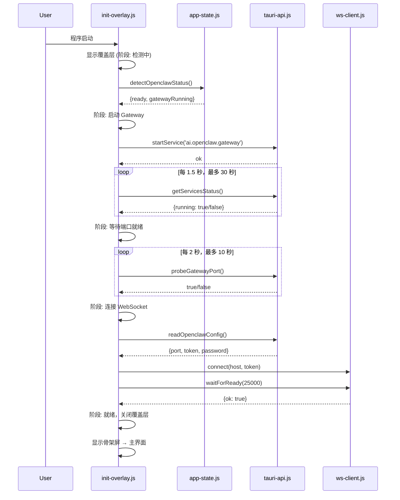

## 产品概述

在 ClawPanel 桌面应用启动时，用一个带有阶段进度指示的前台加载覆盖层替代现有极简 splash 屏，严格按照 Gateway 服务启动验证 → WebSocket 连接的有序依赖执行初始化流程，完成后平滑过渡至主界面。

## 核心功能

- **前台加载进度框**：启动时在前台显示一个带阶段指示的初始化弹窗/覆盖层，显示当前执行阶段（检测状态、启动 Gateway、等待就绪、WebSocket 连接等）、进度指示器和友好提示
- **严格依赖顺序**：Gateway 启动并验证通过后才能建立 WebSocket 连接；Gateway 失败则阻断 WS 并显示错误
- **Gateway 启动与验证**：调用后端 API 启动 Gateway 服务，轮询状态确认运行，TCP 端口探测确认可达
- **WebSocket 连接**：Gateway 就绪后自动执行设备配对和凭据配置，建立 WS 连接，等待握手完成
- **平滑过渡**：WS 握手成功后，关闭加载框，显示内容骨架屏后呈现主界面
- **错误处理**：Gateway 启动失败/超时/异常时展示详细错误信息和恢复操作（重试、查看日志）；WS 连接失败时展示降级提示
- **状态管理**：使用状态机管理初始化阶段（idle / detecting / starting-gateway / waiting-gateway / connecting-ws / handshaking / ready / error），对外暴露查询接口

## 技术栈

- 前端框架：原生 JavaScript（ES Module）
- 构建工具：Vite
- 桌面框架：Tauri（Rust 后端）
- WebSocket：原生 WebSocket API（已封装在 ws-client.js）

## 实现方案

### 核心策略

创建一个独立的 `init-progress.js` 模块，封装初始化状态机和 UI 覆盖层。在 `main.js` 的 `boot()` 流程中插入有序初始化管线——废除当前独立的 splash 隐藏 + Gateway 事件监听式 WS 连接模式，改为 Gateway→WS 串行 Promise 链，由状态机驱动 UI 更新。

### 关键设计决策

1. **不替换 index.html splash，而是叠加覆盖层**：保留 splash 作为 JS 加载前的兜底检测，在 `main.js` boot() 开始时创建一个新的 `#init-overlay` 覆盖层（悬浮在 splash 之上），boot 完成后关闭。这样不破坏现有的多阶段 splash 检测（WebView2 问题/超时检测）。

2. **状态机驱动**：使用一个简单的对象状态机（非引入库）管理初始化阶段，每个阶段对应 UI 文本、进度百分比和错误态。状态转换严格单向——只能前向推进或跳转到 error。

3. **Gateway→WS 串行 Promise 链**：

```
detectOpenclawStatus() → startGateway() → waitGatewayReady() → autoPair+reload → wsClient.connect() → wsClient.waitForReady() → done
```

每个步骤返回 Promise，失败时 reject 携带错误信息，阻断后续步骤。

4. **保持向后兼容**：不破坏现有的 `onGatewayChange` 监听、Gateway 横幅、守护恢复等后置逻辑。初始化完成后，后续 Gateway 状态变化仍走事件监听。

### 性能与可靠性

- Gateway 启动后轮询确认：最长等待 30 秒，每 1.5 秒检测一次服务状态
- TCP 端口探测：最长 10 秒，每 2 秒探测一次
- WebSocket 握手：最长 25 秒（使用 wsClient.waitForReady）
- 各阶段超时独立，超时后进入 error 状态展示具体原因
- 所有步骤异常捕获，error 状态下显示重试按钮（重新执行整个初始化链）

### 避免技术债务

- 所有新 UI 样式写入 `components.css`，复用现有 CSS 变量（--bg-*, --text-*, --primary, --radius-md 等）
- 新模块 `src/lib/init-progress.js` 独立职责，不侵入现有 app-state.js、ws-client.js 核心逻辑

## 架构设计

### 初始化流程（Mermaid 时序图）



### 状态机定义

```
idle → detecting → starting-gateway → waiting-gateway → connecting-ws → handshaking → ready
                                                                                      ↓
                                                                                    error (any step fails)
```

## 目录结构

```
project-root/
├── src/
│   ├── lib/
│   │   └── init-progress.js        # [NEW] 初始化进度管理模块。包含：
│   │                               #   - InitStateMachine 类：状态机（阶段转换、订阅通知）
│   │                               #   - InitOverlay 类：创建/更新/关闭覆盖层 UI
│   │                               #   - runInitPipeline() 函数：执行有序初始化管线
│   │                               #   - showInitOverlay() / hideInitOverlay() 快捷函数
│   │                               #   - 所有阶段的超时、错误处理、重试逻辑
│   ├── main.js                     # [MODIFY] 修改 boot() 流程，在 splash 隐藏后骨架屏之前
│   │                               #   插入 init-progress.js 的初始化管线；失败时展示错误 UI
│   │                               #   替代现有自动 Gateway→WS 连接逻辑（保留后置监听）
│   ├── style/
│   │   └── components.css          # [MODIFY] 添加 init-overlay 相关的 CSS 样式
│   └── lib/
│       └── app-state.js            # [MODIFY] 可能添加初始化状态查询方法（可选）
```

### 详细的文件职责

**src/lib/init-progress.js [NEW]**：

- 导出 `InitStateMachine` 类：维护初始化阶段枚举和当前状态；提供 `onStateChange(fn)` 订阅；提供 `transitionTo(stage, payload)` 推进状态
- 导出 `InitOverlay` 类：`create(parentEl)` 创建覆盖层 DOM；`update(stage, message, progress)` 更新进度文本和进度条；`showError(title, detail, actions)` 展示错误面板；`close()` 关闭并移除
- 导出 `runInitPipeline(opts)` 异步函数：按序执行 detect → startGateway → waitGatewayReady → connectWS 的 Promise 链；每个步骤报告进度；返回 `{ success, error }`
- 常量定义：阶段名称、阶段进度百分比映射、各步骤超时时间

**src/main.js [MODIFY]**：

- 在 `boot()` 中 `ensureWebSession.then(...)` 的回调里，当引擎就绪且为 OpenClaw 引擎时，将现有的 `isGatewayRunning() ? autoConnectWebSocket()` 和 `onGatewayChange(...)` 替换为调用 `runInitPipeline()`
- 保留 `onGatewayChange` 监听器（用于后续 Gateway 状态变化时的 WS 重连/断开）
- 保持 `setupGatewayBanner()` 不变（用于 Gateway 未运行时的横幅提示）

**src/style/components.css [MODIFY]**：

- 添加 `#init-overlay` 覆盖层样式：全屏固定定位、高斯模糊背景、居中卡片、阶段名称文本、进度条动画、错误面板样式
- 复用现有 CSS 变量和骨架屏样式

## 关键代码结构

### 状态机定义

```
阶段: idle(0%) → detecting(10%) → starting-gateway(25%) → waiting-gateway(50%) →
      connecting-ws(70%) → handshaking(85%) → ready(100%)
      any → error(显示具体阶段和错误信息)
```

### InitOverlay 覆盖层 DOM 结构

```
#init-overlay (全屏固定, z-index: 99998)
  └── .init-card (居中卡片)
      ├── .init-logo (图标/SVG)
      ├── .init-title (阶段标题)
      ├── .init-stage-text (当前阶段文本)
      ├── .init-progress-bar (进度条容器)
      │   └── .init-progress-inner (进度条填充)
      ├── .init-status (状态消息,用于超时/错误提示)
      └── .init-error (错误面板,含出错阶段名+错误信息+重试按钮)
```

### runInitPipeline 核心逻辑（伪代码）

```
async function runInitPipeline() {
  state.transitionTo('detecting')
  const status = await detectOpenclawStatus()

  state.transitionTo('starting-gateway')
  await api.startService('ai.openclaw.gateway')

  state.transitionTo('waiting-gateway')
  await pollGatewayStatus() // 30秒超时

  await probeGatewayPort()  // 10秒超时

  state.transitionTo('connecting-ws')
  const config = await api.readOpenclawConfig()
  // 设备配对 + reload
  // wsClient.connect(host, token, {password})

  state.transitionTo('handshaking')
  const result = await wsClient.waitForReady(25000)
  if (!result.ok) throw new Error(result.reason)

  state.transitionTo('ready')
}
```

# Agent Extensions

本计划主要通过代码探索来制定精准方案，不需要专门的 Agent Extensions 来执行。