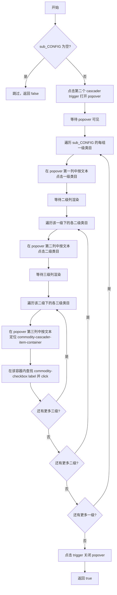

## 用户需求

在"品类趋势参考→二级类目"视图中，清除第二个级联选择器 tag 后，根据 `sub_CONFIG` 配置数组自动点击第三级列的 `commodity-checkbox` 复选框，实现三级类目自动选择，替代当前的手动操作暂停。

## 核心功能

1. **重定义 `sub_CONFIG`**：将第 52-63 行的占位示例替换为真实三级类目数据，结构为 `{ first: 一级类目, second: [{ name: 二级类目, third: [三级类目列表] }] }`
2. **创建 `selectSubCategory` 函数**：自动打开第二个 cascader 的弹出面板，按 `sub_CONFIG` 依次导航一级→二级→点击三级 checkbox
3. **接入主流程**：在 `clearCategoryCascader(page, 1, false)` 之后调用新函数，替换第 887 行的手动暂停交互

## 技术选型

- 运行环境：Node.js + Playwright（与现有项目一致）
- 复用现有模式：`escapeRegex` 工具函数、popover 打开/关闭模式、`LOG` 日志工具

## 实现方案

### sub_CONFIG 数据结构

基于用户提供的 DOM 结构，`sub_CONFIG` 采用三级嵌套数组：

```javascript
const sub_CONFIG = [
  {
    first: '服饰内衣',
    second: [
      {
        name: '女装',
        third: [
          'POLO衫', 'T恤', '抹胸', '毛衣', '皮衣', '短裤',
          '衬衫', '裤子', '西装', '风衣', '马夹', '卫衣/绒衫',
          '棉衣/棉服', '婚纱/旗袍/礼服', '唐装/民族服装/舞台服装',
          '套装/学生校服/工作制服'
        ]
      }
    ]
  }
];
```

### selectSubCategory 函数设计

**调用签名**：`async function selectSubCategory(page, cascaderIndex = 1)`

**执行流程**：



**三级 checkbox 点击策略**（关键实现）：

第三列每项 DOM 结构为 `commodity-list-item-container` 内包含 `label.commodity-checkbox`（checkbox）和 `commodity-cascader-item-label`（文本）。按以下步骤定位：

1. 用 `page.locator` 在 popover 第三列（`.commodity-cascader-column:nth-child(3)`）中按文本匹配 `commodity-cascader-item-label > div`
2. 通过 `locator('.commodity-checkbox').first()` 找到同级的 checkbox
3. 使用 `click({ force: true })` 或 `dispatchEvent('click')` 触发勾选

**ReactVirtualized 处理**：virtualized 列表只渲染视口内的 DOM 节点。导航到对应列后需 `waitForTimeout` 确保渲染完成；文本搜索使用 `filter({ hasText })` + `first()` 组合，Playwright 的 auto-wait 机制会等待匹配元素出现。

**Stale ElementHandle 防护**：每次点击后 DOM 可能更新，所有列级定位使用 `page.locator`（惰性求值）而非 `page.（立即获取 ElementHandle），避免 stale handle 问题。

### 主流程接入

在 `yuntu-login.js` 第 881 行（清除 tag 的日志输出后）新增：

```javascript
// 根据 sub_CONFIG 自动选择三级类目 checkbox
await selectSubCategory(page, 1);
```

替换第 886-887 行的 `pauseForInteraction` 手动暂停。

## 实现注意事项

### 性能

- 每次点击间 `waitForTimeout(300-500ms)` 给 DOM 更新留足时间
- 三级列有 16 项时总点击量可控（1+1+16=18 次点击），运行时间约 10-15 秒

### 日志

- 复用现有 `LOG.ok` / `LOG.warn` / `LOG.info` 输出选中结果
- 记录每级导航状态（"已展开一级类目 xxx"、"已展开二级类目 xxx"、"已勾选 N/M 个三级类目"）

### 兼容性

- 新函数不影响现有 `selectCascaderCategory`（二级选择）逻辑
- `sub_CONFIG` 为空时安全跳过，日志提示
- popover 打开/关闭失败时 catch 异常不中断主流程